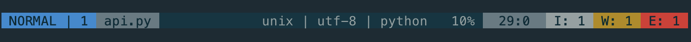

# lightline-lsp

A vim plugin that provides [lightline](https://github.com/itchyny/lightline.vim) components that show [yegappan/lsp](https://github.com/yegappan/lsp) diagnostics status.



## Table Of Contents

- [Installation](#installation)
- [Configuration](#configuration)
- [License](#license)

## Installation

Install using any plugin manager. Here's an example using `vim-plug`:

```viml
Plug 'newtonne/lightline-lsp'
```

## Configuration

### lightline Integration

1. Register the components:

```viml
let g:lightline = {}

let g:lightline.component_expand = {
  \ 'lsp_errors': 'lightline#lsp#errors',
  \ 'lsp_warnings': 'lightline#lsp#warnings',
  \ 'lsp_infos': 'lightline#lsp#infos',
  \ 'lsp_ok': 'lightline#lsp#ok',
  \ }
```

2. Set the colour of the components:

```viml
let g:lightline.component_type = {
  \ 'lsp_errors': 'error',
  \ 'lsp_warnings': 'warning',
  \ 'lsp_infos': 'right',
  \ 'lsp_ok': 'right',
  \ }
```

3. Add the components to lightline:

```viml
let g:lightline.active = {
  \ 'right': [ [ 'lsp_errors', 'lsp_warnings', 'lsp_infos', 'lsp_ok' ],
  \            [ 'lineinfo' ],
  \            [ 'percent' ],
  \            [ 'fileformat', 'fileencoding', 'filetype'] ]
  \ }
```

### Customisation

#### `g:lightline#lsp#indicator_errors`

The indicator to use when there are errors. Default is `E:`.

#### `g:lightline#lsp#indicator_warnings`

The indicator to use when there are warnings. Default is `W:`.

#### `g:lightline#lsp#indicator_infos`

The indicator to use when there are infos. Default is `I:`.

#### `g:lightline#lsp#indicator_ok`

The indicator to use when there are no infos, warnings or errors. Default is `OK`.

## License

Released under the [MIT License](LICENSE)
